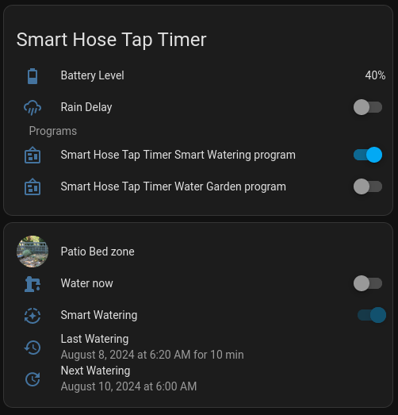

# Orbit B-Hyve Card

[](https://github.com/hacs/integration)

This is a set of card for the [bhyve-home-assistant](https://github.com/sebr/bhyve-home-assistant) integration.



## Install

1. Navigate to the HACS add-on. Go to "Frontend", if HACS has separate pages for Integrations and Frontend.

2. Via the "..." menu at the top right, select "Custom repositories" and add https://github.com/davidn/bhyve-card as type "Lovelace" (or "Plugin", if you are on older HACS versions).

3. If there is a "Explore & download respositories" button, click on it and find "Orbit B-Hyve Card". If you directly see a list of cards, find "Orbit B-Hyve Card" (you may need to clear filters to see integrations that haven't been downloaded). Click on it and then click "Download".

4. When you are prompted to reload the frontend, do so.

## Usage - Per Device Card

Select "Custom: Orbit B-Hyve Zone Card" when adding a card to the dashboard. Configure it with the device ID and per-device and per-zone switch and sensor entities created by the Orbit B-Hyve integration:

```
   type: custom:bhyve-card
   device: abcdef123
   rain_delay: switch.some_rain_delay
   battery_level: sensor.some_battery_level
   programs:
     - switch.some_program_a
     - switch.some_program_b
   zones:
     - switch: switch.some_zone
       history: sensor.some_zone_history
     - switch: switch.some_other_zone
       history: sensor.some_other_zone_history
```

To find the IDs and entities, go to "Settings > Devices & Services > Devices" and click on your b-hyve device:

* The device ID appears in the URL after `config/devices/device/`.
* You can find the zone switch entity IDs by clicking on a zone under "Controls", clicking the gear icon and then copying the Entity ID field.
* You can find the zone history entity IDs by clicking on a zone "history" entity under "Diagnostic", clicking the gear icon and then copying the Entity ID field.
* You can find the program entity IDs by clicking on a program under "Configuration", clicking the gear icon and then copying the Entity ID field.

## Usage - Per Zone Card

Select "Custom: Orbit B-Hyve Zone Card" when adding a card to the dashboard. Configure it with the switch and history sensor entities created by the Orbit B-Hyve integration for the zone you want to report:

```
   type: custom:bhyve-card
   switch: switch.some_zone
   history: sensor.some_zone_history
```

To find the entities, go to "Settings > Devices & Services > Devices" and click on your b-hyve device:

* You can find the zone switch entity ID by clicking on the zone under "Controls", clicking the gear icon and then copying the Entity ID field.
* You can find the zone history entity ID by clicking on the zone "history" entity under "Diagnostic", clicking the gear icon and then copying the Entity ID field.
